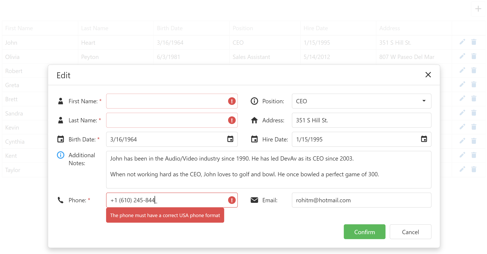

<!-- default badges list -->

<!-- default badges end -->

# DevExtreme DataGrid – Create a custom Pop-up Edit Form using Popup and Form components

Our DataGrid component ships with a built-in Pop-up Edit Form (for data editing purposes). To create a custom pop-up form, simply use our [Popup](https://js.devexpress.com/Documentation/ApiReference/UI_Components/dxPopup/) and [Form](https://js.devexpress.com/Documentation/ApiReference/UI_Components/dxForm/) UI components as follows:

Implement a DataGrid callback function that displays the Popup when a user clicks the built-in "Add row" button. Add a Form to the Popup [contentTemplate](https://js.devexpress.com/Documentation/ApiReference/UI_Components/dxPopup/Configuration/#contentTemplate) and specify desired Popup [toolbar buttons](https://js.devexpress.com/Documentation/ApiReference/UI_Components/dxPopup/Configuration/toolbarItems/). Next, call a function that updates the DataGrid data source once users enter/modify Form values and submit changes (by pressing the "Confirm" button).

## Files to Review

- **jQuery**
    - [index.html](jQuery/src/index.html)
    - [index.js](jQuery/src/index.js)
- **Angular**
    - [app.component.html](Angular/src/app/app.component.html)
    - [app.component.ts](Angular/src/app/app.component.ts)
- **Vue**
    - [App.vue](Vue/src/App.vue)
- **React**
    - [App.js](React/src/App.js)
- **ASP.NET Core**
    - [Index.cshtml](ASP.NET%20Core/Views/Home/Index.cshtml)

## Documentation

- [Getting Started with DataGrid](https://js.devexpress.com/Documentation/Guide/UI_Components/DataGrid/Getting_Started_with_DataGrid/)
- [DataGrid Popup Mode](https://js.devexpress.com/Documentation/Guide/UI_Components/DataGrid/Editing/#User_Interaction/Popup_Mode)
- [DataGrid - API Reference](https://js.devexpress.com/Documentation/ApiReference/UI_Components/dxDataGrid/)
- [Popup - API Reference](https://js.devexpress.com/Documentation/ApiReference/UI_Components/dxPopup/)
- [Form - API Reference](https://js.devexpress.com/Documentation/ApiReference/UI_Components/dxForm/)
<!-- feedback -->
## Does this example address your development requirements/objectives?

 

(you will be redirected to DevExpress.com to submit your response)
<!-- feedback end -->
